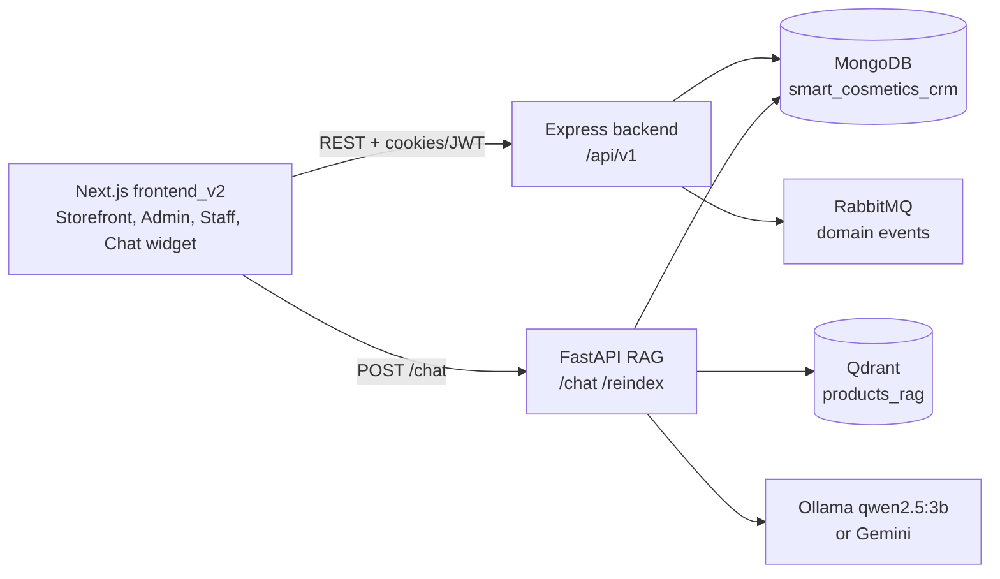

# Smart Cosmetics Commerce with AI Assistant

<p align="center">
  
</p>

<p align="center">
  <strong>Cosmetics ecommerce platform with admin/staff operations and a Vietnamese RAG shopping assistant.</strong>
</p>

<p align="center">
  
  
  
  
  
  
  
</p>

## ✨ Overview

Smart Cosmetics is a LuxBerry cosmetics commerce platform that combines a customer storefront, admin/staff operations, payment integration, product data import, and an AI assistant for Vietnamese beauty product consultation.

> **CRM status:** the current codebase includes admin/staff management screens for users, products, vouchers, orders, customers, and sales operations. A full CRM module for lead pipelines, support tickets, campaigns, customer segmentation, and lifecycle automation is not implemented yet and should be treated as roadmap scope.

The project is split into three runtime applications:

| App | Path | Stack | Default URL |
|---|---|---|---|
| Storefront + Admin/Staff UI | `frontend_v2` | Next.js, React, TypeScript, Tailwind CSS, Zustand, React Query | `http://localhost:3000` |
| Commerce API | `backend` | Node.js, Express, MongoDB, RabbitMQ, Clean Architecture | `http://localhost:5000` |
| AI assistant | `RAG_LANGCHAIN_V4` | FastAPI, LangChain, Qdrant, Ollama/Gemini, Vietnamese embeddings | `http://localhost:8000` |

## 🧩 Features

- 🛍️ Cosmetics storefront with product listing, filters, detail pages, cart, checkout, order history, blogs, reviews, favorites, and account pages.
- 🔐 Authentication with email/password, email verification, refresh tokens, Google login, guest cart merge, and role-based access.
- 🧑‍💼 Admin dashboard for statistics, products, users, vouchers, and role management.
- 🧾 Staff sales workspace for orders, customers, confirmations, cancellations, and status updates.
- 🗂️ CRM roadmap scope documented separately: lead pipeline, customer segmentation, support tickets, campaigns, and lifecycle automation are not part of the current implemented module.
- 💳 PayOS payment flow with return/cancel endpoints and payment state handling.
- 📦 Product import from `backend/data/Hasaki_Data_Final.xlsx` into MongoDB.
- 🤖 Vietnamese RAG chatbot using MongoDB product data, Qdrant vector search, reranking, chat history, and product cards returned to the frontend.
- 🧪 Test suites for backend API/service layers and RAG router/retriever/chat flows.

## 🏗️ Architecture



The backend is the source of truth for product data. After importing the Excel catalog into MongoDB, the RAG service reads the same `products` collection and builds a Qdrant index for semantic product retrieval.

## 📁 Project Structure

```txt
.
├── backend/              # Express API, MongoDB models, services, controllers, tests
├── frontend_v2/          # Next.js storefront, admin/staff UI, chatbot widget
├── RAG_LANGCHAIN_V4/     # FastAPI + LangChain Vietnamese product RAG service
├── DanhGiaChatBot.md     # RAG evaluation summary and artifacts
├── README.md             # English GitHub README
└── README.vi.md          # Vietnamese README
```

## ⚙️ Prerequisites

- Node.js 18+ and npm
- Docker Desktop and Docker Compose
- Python 3.11+ and `uv` for local RAG development
- Optional: NVIDIA GPU for faster Ollama/RAG runtime

## 🚀 Quick Start

### 1. Configure environment files

```bash
cp backend/.env.example backend/.env
cp frontend_v2/.env.example frontend_v2/.env
cp RAG_LANGCHAIN_V4/.env.example RAG_LANGCHAIN_V4/.env
```

Update secrets and provider keys as needed:

- `backend/.env`: JWT secrets, MongoDB URL, Google OAuth, PayOS, SMTP, RabbitMQ.
- `frontend_v2/.env`: API URL, RAG chat URL, Google Client ID, VietMap key.
- `RAG_LANGCHAIN_V4/.env`: MongoDB, Qdrant, Ollama/Gemini, embedding and rerank settings.

### 2. Start backend infrastructure and API

```bash
cd backend
docker compose up -d --build
docker compose exec backend npm run seed:products
docker compose exec backend npm run seed:admin
```

Useful URLs:

| Service | URL |
|---|---|
| API health | `http://localhost:5000/health` |
| Mongo Express | `http://localhost:8081` |
| RabbitMQ dashboard | `http://localhost:15672` |

### 3. Start the RAG assistant

The RAG compose file uses the shared Docker network created by the backend stack.

```bash
cd ../RAG_LANGCHAIN_V4
docker compose up -d --build
docker compose exec app uv run python scripts/build_embeddings.py
```

Health check:

```bash
curl http://localhost:8000/health
```

Example chat request:

```bash
curl -X POST http://localhost:8000/chat \
  -H "Content-Type: application/json" \
  -d '{"user_id":"demo_user","session_id":"demo_session","query":"kem chống nắng đi biển"}'
```

### 4. Start the frontend

```bash
cd ../frontend_v2
npm install
npm run dev
```

Open `http://localhost:3000`.

## 🧪 Test Commands

```bash
# Backend
cd backend
npm test

# Frontend
cd frontend_v2
npm run lint
npm run build

# RAG
cd RAG_LANGCHAIN_V4
uv sync --dev
uv run python -m pytest -q
```

RAG evaluation artifacts are stored in `RAG_LANGCHAIN_V4/outputs/chatbot_evaluation/` and summarized in `DanhGiaChatBot.md`.

## 🔌 Main API Areas

| Area | Prefix |
|---|---|
| Health | `GET /health` |
| Auth | `/api/v1/auth` |
| Products | `/api/v1/products` |
| Cart | `/api/v1/cart` |
| Checkout | `/api/v1/checkout` |
| Orders | `/api/v1/orders` |
| Payments | `/api/v1/payments` |
| Vouchers | `/api/v1/vouchers` |
| Reviews | `/api/v1/reviews` |
| Admin | `/api/v1/admin` |
| Staff | `/api/v1/staff` |
| AI chat | `POST http://localhost:8000/chat` |

## 📚 More Documentation

- Backend guide: [`backend/README.md`](backend/README.md)
- PayOS guide: [`backend/HD_TichHop_PayOS.md`](backend/HD_TichHop_PayOS.md)
- RAG guide: [`RAG_LANGCHAIN_V4/HD_RAG.md`](RAG_LANGCHAIN_V4/HD_RAG.md)
- Chatbot evaluation: [`DanhGiaChatBot.md`](DanhGiaChatBot.md)

## 🔒 Security Notes

- Do not commit real `.env` files or production secrets.
- Rotate JWT, Google OAuth, PayOS, SMTP, and Gemini keys before deployment.
- Keep MongoDB, RabbitMQ, Qdrant, and Ollama behind private networking in production.

## 📄 License

The backend package declares the project license as MIT. Check the repository owner policy before publishing or redistributing datasets and generated assets.
